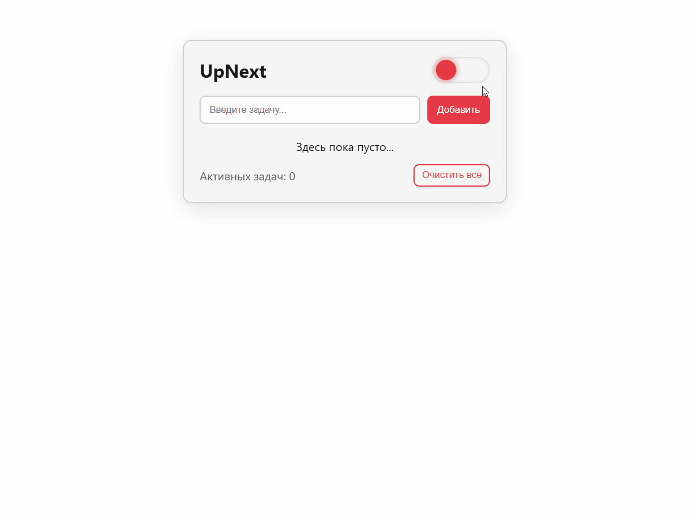
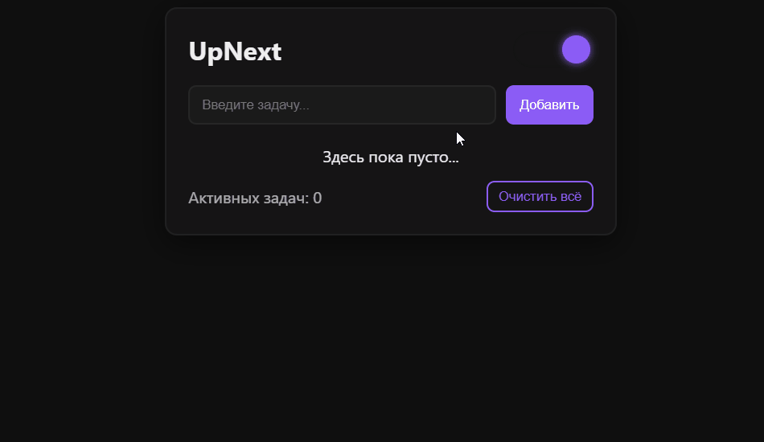
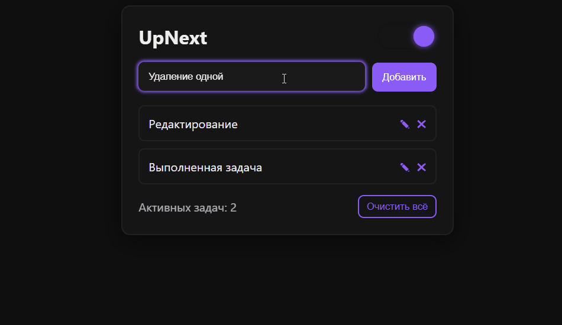

# UpNext - ToDo App

**UpNext** — это современное, минималистичное приложение для управления задачами, созданное на **React + Vite**.  
Оно сочетает простоту, скорость и визуальную эстетику с продуманной архитектурой и защитой от XSS-атак.

 ---

## Preview



_Приложение адаптивно и прекрасно выглядит как на десктопе, так и на мобильных устройствах._

 ---

## Functional

- Добавление, редактирование и удаление задач
- Подсветка поля при вводе, анимация добавления задач
- Сохранение данных в `localStorage` ( с задержкой для оптимизации )
- Переключение темы ( Light / Dark )
- Поддержка ограничения длины задачи ( 22 символа )
- Защита от XSS-атак при вводе
- Анимации появления, тост-уведомления и диалог подтверждения
- Полностью адаптивная верстка

 ---

## Tech Stack

| Категория  | Использовано                                       |
| ---------- | -------------------------------------------------- |
| Frontend   | React ( Hooks, Components )                        |
| Build Tool | Vite                                               |
| Styling    | CSS Modules / Responsive Design                    |
| Storage    | LocalStorage ( с безопасным парсингом и debounce ) |
| Security   | XSS Sanitization                                   |
| Animation  | CSS Transitions & Keyframes                        |

 ---

## Project Structure

src/
┣ components/
┃ ┣ ConfirmDialog.jsx             # Диалог подтверждения
┃ ┣ TaskList.jsx                  # Список задач
┃ ┗ ThemeToggle.jsx               # Переключатель темы
┣ styles/
┃ ┣ App.css                       # Основные стили приложения
┃ ┣ index.css                     # Глобальные переменные и темы
┃ ┣ responsive.css                # Адаптивная верстка
┃ ┗ ThemeToggle.css               # Стили переключателя темы
┣ App.jsx                         # Основная логика приложения
┣ main.jsx                        # Точка входа

 ---

## How It Works

1. При загрузке приложение получает задачи и тему из `localStorage`.
2. При изменениях задачи сохраняются с небольшой задержкой ( debounce ).
3. Все вводимые данные проходят **очистку от опасных символов**.
4. Визуальные эффекты ( анимации, тосты, подтверждения ) управляются через React state.
5. Поддерживаются тёмная и светлая темы.

 ---

## Screenshots / GIFs





 ---

## Run Locally

```bash
# Clone the repository
git clone https://github.com/Fuuuaa/UpNext-ToDo.git

# Go to the project directory
cd UpNext-ToDo

# Install dependencies
npm install

# Start the dev server
npm run dev

 ---

License

This project is released under the MIT License.
Feel free to use, modify and share.
```